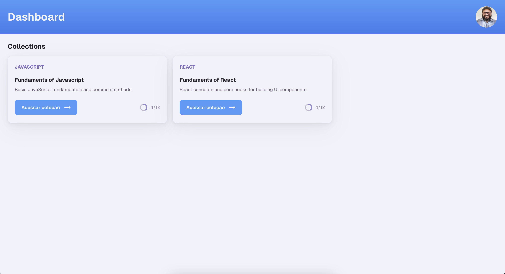
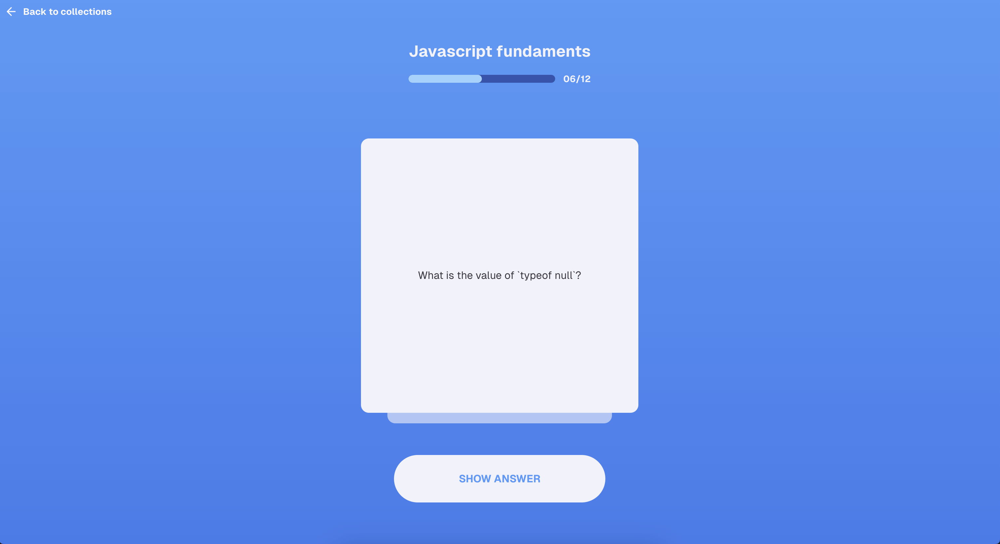
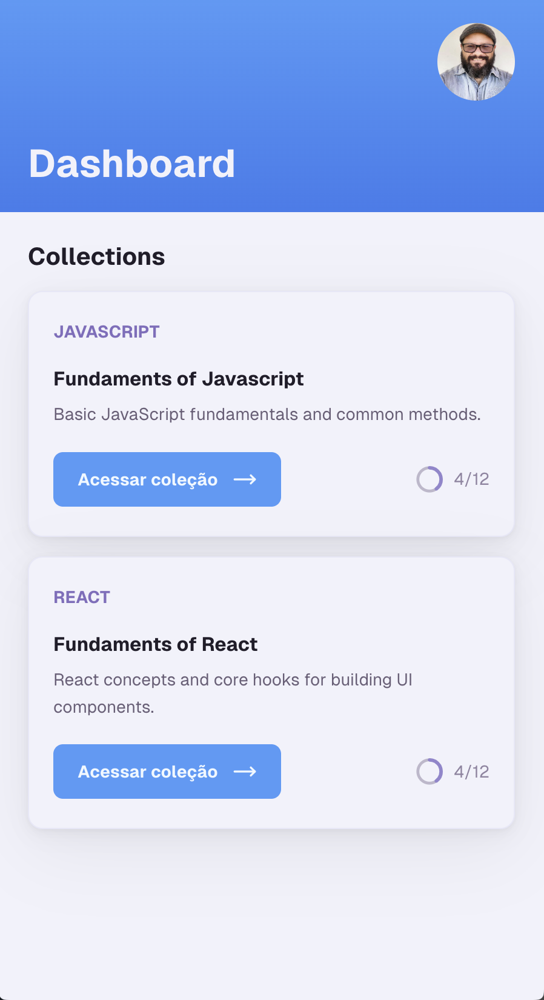

<h1 align="center">FlashCards</h1>

## :dart: About

FlashCards was an application developed from concept in Figma to implementation using a monorepo with Next.js and TurboRepo. It focuses on spaced repetition, allowing users to review concepts and content efficiently, optimizing learning over time

## Screenshots

<div style="display:flex;flex-direction:column;justify-content:center; gap: 10px">
  
  

  <div style="display:flex;justify-content:space-between; gap: 10px">
    
    
  </div>
</div>

## :rocket: Technologies

The following tools were used in this project:

- [Next.js](https://nextjs.org/)
- [TurboRepo](https://turbo.build/)
- [Radix UI](https://www.radix-ui.com/)
- [Tailwind CSS](https://tailwindcss.com/)

## :white_check_mark: Requirements

Before starting :checkered_flag:, you need to have [Git](https://git-scm.com) and [Node](https://nodejs.org/en/) installed.

## :checkered_flag: Starting

```bash
# Clone this project
$ git clone https://github.com/davi1985/flash-cards

# Access
$ cd flash

# Install dependencies
$ yarn

# Run the project
$ yarn start

# The server will initialize in the <http://localhost:3000>
```

Made with :heart: by <a href="https://github.com/davi1985" target="_blank">Davi Silva</a>

&#xa0;

<a href="#top">Back to top</a>
